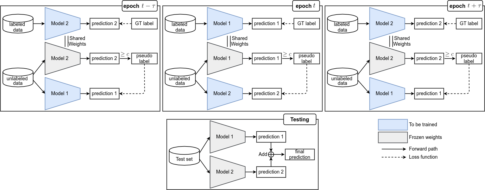

# Learning and Swapping: A Selective Mutual Learning-based Semi-Supervised Approach for Action Recognition

By Duc-Quang Vu, Trang Phung, Jia-Ching Wang, Ngan Le

## Overview

  

## Running the code

### Requirements
- Python3
- Tensorflow (>=2.3.0)
- numpy 
- Pillow
- opencv
- matplotlib
- ...

### Training

In this code, you can reproduce the experimental results of SSL action recognition task in the submitted paper.
The datasets are all open-sourced, so they are easy to download.
Example training settings are for 3D ResNet-18.
Detailed hyperparameter settings are enumerated in the paper.

- Training with baseline (i.e., supervised learning only on the labeled samples)
~~~
python train_supervised.py --model='res18' --clip_len=8 --crop_size=224 --percent=5 --lr=0.01 \
--gpu 0 --batch_size=16 --drop_rate=0.5 --reg_factor=5e-4 --epochs=500 
~~~

- Training Learning and Swapping (Our approach)
~~~
python train_LS.py --model='res18' --clip_len=8 --crop_size=224 --percent=5 --switch=10 \
--confidence=0.8 --gpu 0 --batch_size=16 --drop_rate=0.5 --reg_factor=5e-4 --epochs=500 
~~~

### Evaluation

~~~
python eval.py --model='res18' --clip_len=8 --crop_size=224 --gpu=0
~~~

## Further details
The directory `./train/` `./val/` and `./test/` contains the training videos and val videos and test videos, respectively. Each video converted to a folder contains RGB frames with fps=25. 
To extract frames from the video, you can use `ffmpeg` command. 
To create .csv files, run the command in the following:

~~~
python make_csvfiles.py
~~~

The structure of the csv files is as follows:
~~~
<ROOT_PATH>,<LABEL>,<FOLDER>,<#FRAMES>
~~~
For examples:
~~~
train,SalsaSpin,v_SalsaSpin_g23_c02,134
train,SalsaSpin,v_SalsaSpin_g12_c02,160
train,SalsaSpin,v_SalsaSpin_g20_c01,134
~~~
In which, `train` denotes root path and indicate type of videos (train/val/test).
`SalsaSpin` is the label, `v_SalsaSpin_g23_c02` is the folder that contains all RGB frames of a video.
`134` is the number of the frames in the folder.

## For labeled/unlabeled data splitting 
The `split_data.py` provides a simple function to split the training set (train.csv) into two smaller parts including the train labeled dataset and the train unlabeled dataset via the hyperparameter `Labeled_fraction`.

For example: `Labeled_fraction=0.1` i.e., 10% data of the training set is used for the train labeled dataset and 90% for the train unlabeled dataset.

## Datasets

- UCF-101: contains 101 different action categories with 13,320 videos. Link: https://www.crcv.ucf.edu/data/UCF101.php
- HMDB-51: contains 6,766 videos distributed in 51 human action classes. Link: https://serre-lab.clps.brown.edu/resource/hmdb-a-large-human-motion-database/#dataset
- Jester: contains 119K videos across 27 annotated classes. Link: https://20bn.com/datasets/jester/v1
- Kinetics: contains 306K 10-second videos in 400 action classes. Link: https://deepmind.com/research/open-source/kinetics

## Citation
Coming soon.

